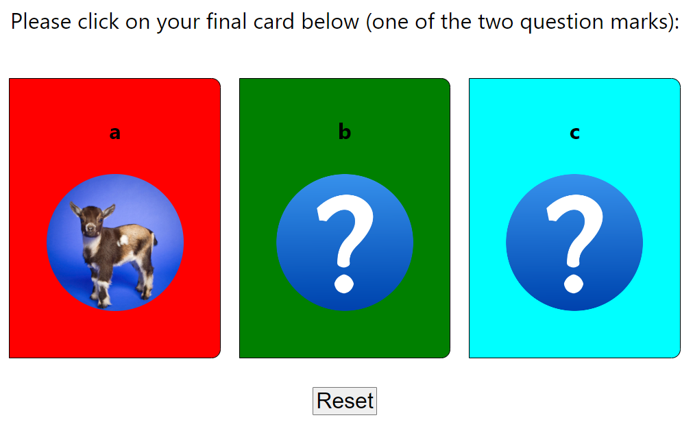

# The Monty Hall Problem

**Table Of Contents**

- [Author](#author)
- [Introduction](#introduction)
- [Installation](#installation)
- [Rules of the Game](#rules)
- [Did you know?](#dyk)

## Author

<a href="https://github.com/HenriBranken" target="_blank">Henri Branken</a>

## Introduction

This is an app that simulates the _Monty Hall Problem_.

This app is ideal in showcasing the importance of properly handling the **`state`** of the app based on specific user-events. You will notice that this app makes use of **`useReducer()`** to manage the state in the app.

## Installation

- Navigate to the main folder of the application.
- Spin up a terminal, and enter the command **`npm install`**. This will install the `node_modules` folder containing all the code dependencies.
- Again, from the terminal, enter the command **`npm start`**.
- This should spin up a web-browser tab at the following address: [http://localhost:3000](http://localhost:3000).
- From there you should be able to interact with the User Interface of the app.

## The Rules of the Game

- The player selects a door.
- The Host randomly selects a different door and opens it. This door will always reveal a "goat".
- The Host gives the player the option of switching from his original choice to the remanining closed door.
- The door finally selected by the player is opened. If it is another "goat", the player loses; if not, the player wins the game.

## Did you know?

It has been mathematically & statistically shown that the probability of winning doubles when you switch doors. This begs the question of _why_ this is the case. An intuitive feeling dictates that the final two doors each have a probability of winning of 50/50.

However, this is only the case if the entire Monty-Hall game is random, and there are unchanging probabilities. In short, the Monty Hall Problem violates the Randomness Assumption.

For more detail on this topic, feel free to visit a site such as <a href="https://statisticsbyjim.com/fun/monty-hall-problem/" target="_blank">this</a> one.
